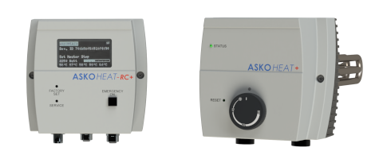

# ASKOHEAT+ für Home Assistant

Custom Integration für den [ASKOHEAT+](https://www.askoma.com) PV-Heizstab
(Hersteller Askoma) — liest das Gerät über dessen lokale REST-API aus und
steuert es.

**Status:** Phase 1 (Lesen) + Phase 2 (Steuern, inkl. Keep-Alive gegen den
60s-Verfall gesetzter Werte) + Phase 3 (Dashboard) — Sensoren/Binary-Sensoren,
Number-/Switch-Entities zum Setzen von Heizstufe/Leistungsvorgabe/
Einspeisewert/Notbetrieb, sowie ein eigenes Lovelace-Dashboard mit
Heizstab-Bildern und Live-Werten als Overlay.

## Dokumentation

Vollständige, durchnummerierte Doku auf Deutsch unter
[`custom_components/askoheat_plus/docs/de/`](custom_components/askoheat_plus/docs/de/),
Start bei [`01_ueberblick.md`](custom_components/askoheat_plus/docs/de/01_ueberblick.md).
Englische Übersetzung unter
[`custom_components/askoheat_plus/docs/en/`](custom_components/askoheat_plus/docs/en/)
(Start bei [`01_overview.md`](custom_components/askoheat_plus/docs/en/01_overview.md)) —
Deutsch ist die primäre, maßgebliche Version.

## Installation

Siehe [`04_installation.md`](custom_components/askoheat_plus/docs/de/04_installation.md)
(HACS, manuell, oder lokale Entwicklung per Symlink).

## Bedienung

Kurzer Rundgang mit Screenshots (Dashboard, Geräteseite, Rekonfiguration,
Einspeisewert-/Leistungsvorgabe-Verknüpfung): siehe
[`12_bedienung.md`](custom_components/askoheat_plus/docs/de/12_bedienung.md).

## Dashboard

Eigenes Lovelace-Dashboard mit Bild-Overlays (Andreas' Askoma-Renderbilder),
unterstützt beliebig viele Geräte (eine Ansicht pro Heizstab, automatisch
generiert aus `dashboard/generate_dashboard.py`): siehe
[`11_dashboard.md`](custom_components/askoheat_plus/docs/de/11_dashboard.md).

## Automatisierung

Mitgelieferte Blueprint, um den Einspeisewert automatisch aus einem Zähler-/
Wechselrichter-Sensor zu befüllen: siehe
[`10_automatisierung.md`](custom_components/askoheat_plus/docs/de/10_automatisierung.md).

## Repositories

- **[GitLab](https://gitlab.com/SyberAlf/ah-homeassistent-addon)** — Haupt-Repo für die Entwicklung.
- **[GitHub](https://github.com/Andreas8476/AH-HomeAssistent-AddOn)** — öffentlicher Spiegel, nötig für die HACS-Installation (HACS unterstützt nur GitHub). Beide enthalten denselben Stand.

## Changelog

Siehe [CHANGELOG.md](CHANGELOG.md).

## Autor

Entwickelt von **Andreas Stegemann** in Zusammenarbeit mit **Claude**
(Anthropic, Modell Sonnet 5) als Coding-Assistent.

Andreas ist Mitarbeiter der **ASKOMA AG** (Bützberg, Schweiz), Hersteller des
ASKOHEAT+ und weiterer Heizelemente/Thermostate für Trink- und Heizungswasser
(u.a. Produktlinien ASKOHEAT+ und ASKOFAMILY+, [askoma.com](https://www.askoma.com)).
Dieses Projekt ist jedoch ein **privates Projekt für den Eigengebrauch** und
**keine offizielle Software der ASKOMA AG** — es basiert auf öffentlich
zugänglicher Herstellerdokumentation der REST-/Modbus-Schnittstelle.

## Lizenz

MIT, siehe [LICENSE](LICENSE).
