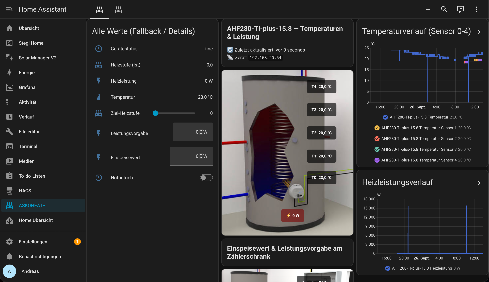
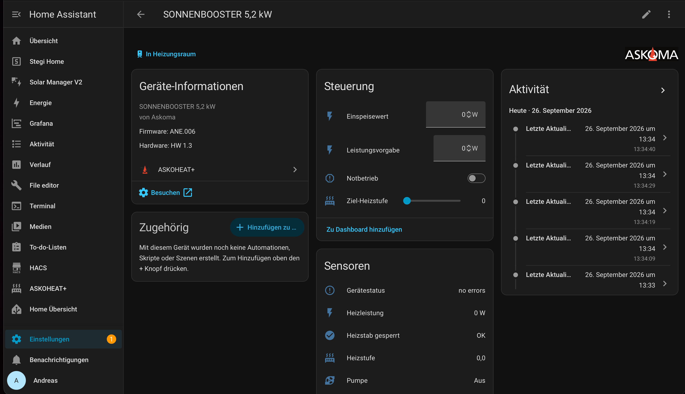
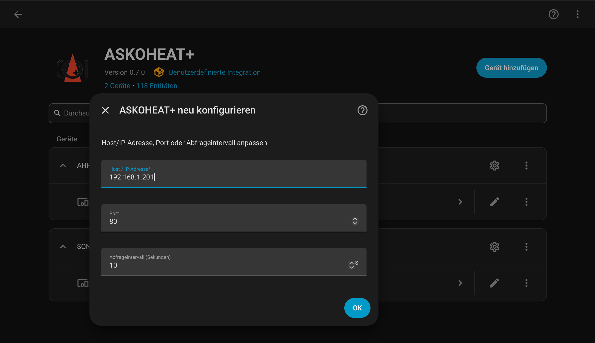
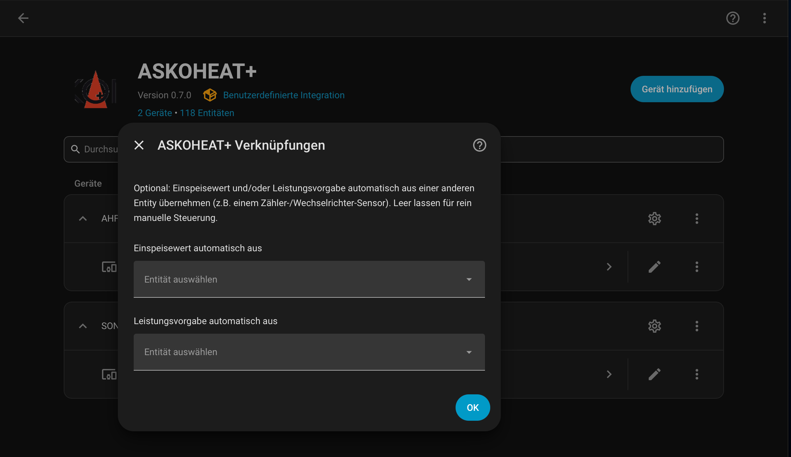

# 12 — Bedienung des AddOns

*[English version](../en/12_usage.md)*

Kurzer Rundgang mit Screenshots durch die vier wichtigsten Stellen, an denen
man mit der Integration im Alltag zu tun hat: Dashboard, Geräteseite,
Rekonfiguration und die eingebaute Einspeisewert-/Leistungsvorgabe-
Verknüpfung.

## Dashboard

Die automatisch generierte Dashboard-Ansicht (siehe
[11_dashboard.md](11_dashboard.md)) — eine Ansicht pro Gerät, erreichbar
über den Menüpunkt mit dem Heizstab-Symbol in der Seitenleiste. Links die
Fallback-Tabelle mit allen Werten, in der Mitte Heizstab- und
Zählerschrank-Bild mit Live-Werten als Overlay, rechts die beiden
Verlaufs-Grafen (Temperatur, Heizleistung).

## Geräteseite (Steuerung & Sensoren)

Die von Home Assistant automatisch erzeugte Geräteseite — erreichbar über
**Einstellungen → Geräte & Dienste → ASKOHEAT+** und dann Klick auf den
Gerätenamen (z.B. "SONNENBOOSTER 5,2 kW"). Home Assistant gruppiert die
Entities hier selbstständig nach Domäne: die Karte "Steuerung" zeigt die
schreibbaren `number`-Entities (Einspeisewert, Leistungsvorgabe,
Ziel-Heizstufe) und den Notbetrieb-Schalter, die Karte "Sensoren" die
read-only-Werte (Gerätestatus, Heizleistung, Heizstufe, Pumpe, ...). Kein
eigenes UI dieser Integration — reine Home-Assistant-Standardansicht.

## Neu konfigurieren (Host/Port/Abfrageintervall ändern)

Über **Einstellungen → Geräte & Dienste → ASKOHEAT+** → beim betreffenden
Gerät auf das **⋮**-Menü → **Neu konfigurieren**. Hier lassen sich Host/
IP-Adresse, Port und Abfrageintervall jederzeit nachträglich ändern, ohne
das Gerät neu einzurichten (siehe auch
[04_installation.md](04_installation.md)).

## Verknüpfungen (Einspeisewert/Leistungsvorgabe automatisch befüllen)

Über **Einstellungen → Geräte & Dienste → ASKOHEAT+** → beim betreffenden
Gerät auf das **⚙**-Symbol ("Konfigurieren"). Hier lässt sich Einspeisewert
und/oder Leistungsvorgabe direkt mit einer beliebigen anderen Entity
verknüpfen (z.B. einem Zähler-/Wechselrichter-Sensor) — Entität auswählen,
mit OK bestätigen, fertig. Leer lassen für weiterhin rein manuelle
Steuerung. Details/Funktionsweise: [10_automatisierung.md](10_automatisierung.md).
